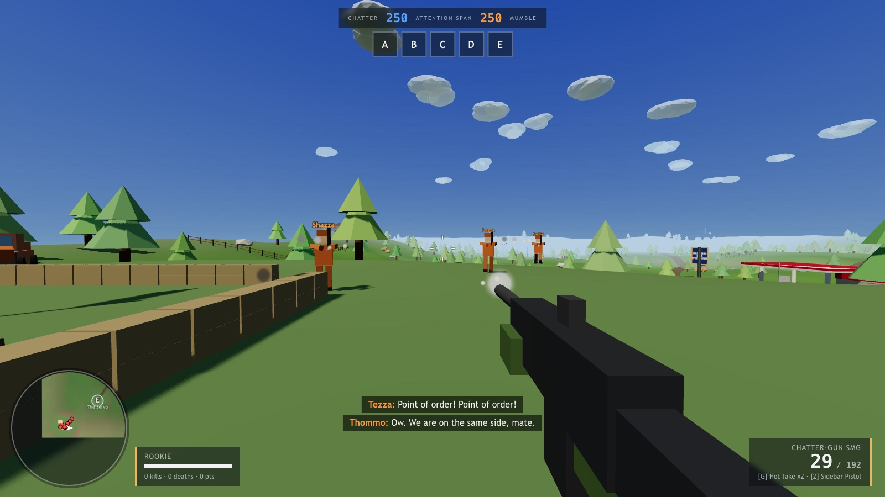

# Prattlefield

A Battlefield-style conquest shooter where nobody stops talking. Two teams of loudmouths fight over five flags on Operation Small Talk while their Attention Span drains. Built with Three.js, no external assets, everything procedural.



## Run

```sh
make install
make run      # vite dev server
make build    # production bundle in dist/
make lint     # tsc --noEmit
make test     # vitest
```

Open the URL vite prints, click Butt In, pick a gun and a grenade, click a spawn point and deploy. Chrome or Firefox on desktop. The bots literally speak via the browser's speech synthesis, so turn your volume down if you are in an open plan office.

The game captures the mouse while you play. Esc releases it and pauses your input; click the game to grab it back.

## Controls

- WASD move, Shift sprint (starts with an inhaler puff, cardio is not their strong point), Space jump, C or Ctrl crouch
- Mouse look, left click fire, right click aim down sights
- R reload, 1 / 2 / wheel swap weapon, G throw your grenade
- Q say something unhelpful, E get in or out of the Ute, H horn
- Tab scoreboard, Esc release the mouse

## Gunplay

- First shot from a rested gun is accurate. Sustained fire blooms the cone, resting shrinks it again.
- Aiming down sights tightens the cone, moving or jumping widens it, crouching narrows it.
- Recoil kicks the view up and sideways per shot and settles most of the way back once you let go.
- Every gun has a damage falloff: full damage inside its comfortable range, a floor beyond it. The shotgun dies past twenty metres, the sniper never drops.
- Friendly fire is on for bullets, grenades and the Ute. Team kills cost 50 score and earn an escalating award nobody wants. Bots hold fire when a teammate is in the way.
- The Point-Maker sniper swaps the gun model for a scope overlay once you are fully aimed in.
- Six primaries: Chatter-Gun SMG, Talking Point rifle, Monologue LMG, Interruption shotgun, Point-Maker sniper, Rebuttal Launcher. Everyone carries the Sidebar pistol.
- Three grenades: Hot Take (frag, three second fuse), Mic Drop (explodes on contact), Awkward Silence (stuns everyone nearby, you included).

## What is in it

- Conquest: five capture points (The Pub, Bus Stop, The Roundabout, Bunnings, The Servo). Holding fewer flags bleeds your Attention Span. First to zero loses. Standing on a flag your team holds resupplies ammo and grenades.
- Pick your own loadout. Bots come in six personalities (Yapper, Debater, Podcaster, Heckler, Lecturer, Mechanic), one per primary.
- 22 bots with objective driven AI, uneven skill, and constant chatter. They spot, flank badly, reload at the worst moment and celebrate headshots.
- The Ute: a drivable vehicle per team with roadkill, wreck and respawn.
- Prattlevolution: the water tower can be knocked over with explosives. It lands on people.
- Procedural low poly map with terrain, creek, roads, forests and themed set pieces. Procedural audio (guns, explosions, a parody stinger) synthesised with Web Audio.

## Layout

- `src/config.ts` every tunable: weapons, classes, flags, teams, match rules, theme colours
- `src/world/` terrain heightfield, colliders and raycasting, props, flags, the water tower
- `src/entities/` shared soldier physics, player controller and viewmodel, bot AI, vehicle
- `src/combat/` weapon state and hitscan, projectiles, pooled effects
- `src/audio/` Web Audio synth and speech synthesis voice routing
- `src/prattle/lines.ts` all the jokes
- `src/ui/` HUD, minimap, deploy and end screens, styles
- `src/game.ts` state machine and loop, `src/match.ts` conquest rules and event routing

In dev builds `window.__prattlefield.debugStep(seconds)` fast-forwards the simulation without rendering, and `debugSnapshot()` reports tickets, flags and kills. Used by headless smoke tests.
